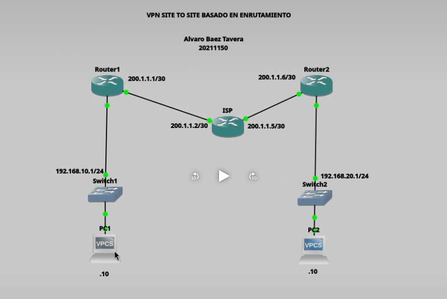
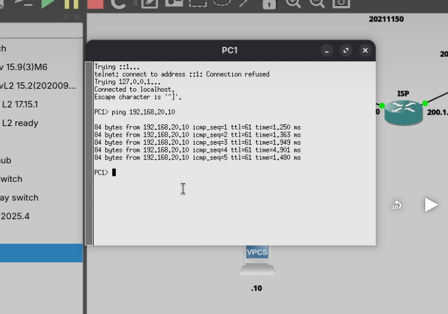

# VPN Site-to-Site Basada en Enrutamiento (Route-Based VPN)

**Alumno:** Alvaro Smilk Baez Tavera  
**Matrícula:** 20211150

---

# Objetivo

Implementar una VPN Site-to-Site basada en enrutamiento (Route-Based VPN) utilizando Virtual Tunnel Interface (VTI) e IPSec IKEv2 entre dos routers Cisco. La VPN permite establecer una comunicación segura entre dos redes LAN remotas mediante un túnel virtual protegido con IPSec.

---

# Topología



---

# Descripción de la topología

La infraestructura utilizada está conformada por:

- Router 1
- Router ISP
- Router 2
- Switch LAN 1
- Switch LAN 2
- PC1
- PC2

Los routers R1 y R2 establecen un túnel VTI protegido mediante IPSec IKEv2 a través del router ISP, permitiendo la comunicación segura entre ambas redes LAN.

---

# Direccionamiento IP

| Dispositivo | Interfaz | Dirección IP |
|-------------|----------|--------------|
| Router1 | G0/0 | 200.1.1.1/30 |
| Router1 | G0/1 | 192.168.10.1/24 |
| Router1 | Tunnel0 | 10.10.10.1/30 |
| ISP | G0/0 | 200.1.1.2/30 |
| ISP | G0/1 | 200.1.1.5/30 |
| Router2 | G0/0 | 200.1.1.6/30 |
| Router2 | G0/1 | 192.168.20.1/24 |
| Router2 | Tunnel0 | 10.10.10.2/30 |
| PC1 | NIC | 192.168.10.10/24 |
| PC2 | NIC | 192.168.20.10/24 |

---

# Parámetros utilizados

## IKEv2

| Parámetro | Valor |
|-----------|-------|
| Versión | IKEv2 |
| Cifrado | AES-CBC-256 |
| Integridad | SHA-256 |
| Grupo DH | 14 |
| Autenticación | Pre-Shared Key |

---

## IPSec

| Parámetro | Valor |
|-----------|-------|
| Transform Set | VPNSET |
| Cifrado | ESP-AES-256 |
| Integridad | ESP-SHA256-HMAC |
| Modo | Tunnel |

---

## Clave Compartida

```
cisco123
```

---

# Configuración del Router 1

```cisco
conf t

crypto ikev2 proposal PROPUESTA
 encryption aes-cbc-256
 integrity sha256
 group 14

crypto ikev2 policy POLITICA
 proposal PROPUESTA

crypto ikev2 keyring LLAVERO
 peer R2
  address 200.1.1.6
  pre-shared-key cisco123

crypto ikev2 profile PERFIL
 match identity remote address 200.1.1.6 255.255.255.255
 identity local address 200.1.1.1
 authentication remote pre-share
 authentication local pre-share
 keyring local LLAVERO

crypto ipsec transform-set VPNSET esp-aes 256 esp-sha256-hmac
 mode tunnel

crypto ipsec profile IPSEC-PROFILE
 set transform-set VPNSET
 set ikev2-profile PERFIL

interface Tunnel0
 ip address 10.10.10.1 255.255.255.252
 tunnel source GigabitEthernet0/0
 tunnel destination 200.1.1.6
 tunnel mode ipsec ipv4
 tunnel protection ipsec profile IPSEC-PROFILE

ip route 192.168.20.0 255.255.255.0 Tunnel0

end

write memory
```

### Explicación

En Router 1 se configuró una propuesta IKEv2 utilizando AES-256 y SHA-256. Posteriormente se creó el Keyring, el perfil IKEv2, el perfil IPSec y la interfaz Tunnel0 protegida mediante IPSec. Finalmente se configuró una ruta estática hacia la red remota utilizando el túnel virtual.

---

# Configuración del Router 2

```cisco
conf t

crypto ikev2 proposal PROPUESTA
 encryption aes-cbc-256
 integrity sha256
 group 14

crypto ikev2 policy POLITICA
 proposal PROPUESTA

crypto ikev2 keyring LLAVERO
 peer R1
  address 200.1.1.1
  pre-shared-key cisco123

crypto ikev2 profile PERFIL
 match identity remote address 200.1.1.1 255.255.255.255
 identity local address 200.1.1.6
 authentication remote pre-share
 authentication local pre-share
 keyring local LLAVERO

crypto ipsec transform-set VPNSET esp-aes 256 esp-sha256-hmac
 mode tunnel

crypto ipsec profile IPSEC-PROFILE
 set transform-set VPNSET
 set ikev2-profile PERFIL

interface Tunnel0
 ip address 10.10.10.2 255.255.255.252
 tunnel source GigabitEthernet0/0
 tunnel destination 200.1.1.1
 tunnel mode ipsec ipv4
 tunnel protection ipsec profile IPSEC-PROFILE

ip route 192.168.10.0 255.255.255.0 Tunnel0

end

write memory
```

### Explicación

Router 2 fue configurado como el extremo remoto del túnel VTI utilizando los mismos parámetros criptográficos que Router 1. La interfaz Tunnel0 permite transportar el tráfico cifrado entre ambas redes LAN, mientras que la ruta estática envía el tráfico remoto a través del túnel.

---

# Configuración del Router ISP

```cisco
interface GigabitEthernet0/0
 ip address 200.1.1.2 255.255.255.252
 no shutdown

interface GigabitEthernet0/1
 ip address 200.1.1.5 255.255.255.252
 no shutdown
```

### Explicación

El router ISP proporciona conectividad entre ambos routers. No participa en el proceso de cifrado ni autenticación del túnel VPN.

---

# Funcionamiento

Una vez establecida la VPN, el tráfico entre las redes:

- 192.168.10.0/24
- 192.168.20.0/24

es encapsulado dentro de la interfaz virtual Tunnel0 y protegido mediante IPSec IKEv2, garantizando la confidencialidad, autenticidad e integridad de la información transmitida.

---

# Prueba de funcionamiento

Se realizó una prueba de conectividad entre ambas redes LAN utilizando el comando **ping**.

Desde la PC1 (192.168.10.10) se realizó un ping hacia la PC2 (192.168.20.10), obteniendo respuesta satisfactoria a través del túnel VPN.

---

# Resultado

Las pruebas realizadas demostraron el correcto funcionamiento de la VPN Site-to-Site basada en enrutamiento, permitiendo la comunicación segura entre ambas redes LAN mediante un túnel VTI protegido con IPSec IKEv2.

---

# Conclusión

La implementación de una VPN basada en enrutamiento utilizando Virtual Tunnel Interface simplifica el enrutamiento del tráfico protegido, ya que permite tratar el túnel como una interfaz lógica dentro de la tabla de rutas del router. Mediante IPSec IKEv2 se logró establecer una comunicación segura entre ambas sedes, verificando su funcionamiento mediante pruebas exitosas de conectividad.

---

# Evidencias

## Figura 1. Topología implementada


**Descripción:** Topología utilizada para implementar la VPN Site-to-Site basada en enrutamiento utilizando Virtual Tunnel Interface (VTI).

---

## Figura 2. Prueba de conectividad



**Descripción:** Prueba de conectividad realizada desde la PC1 hacia la PC2. La respuesta exitosa confirma que el túnel VTI protegido mediante IPSec IKEv2 fue establecido correctamente.

---

# Scripts de configuración

Los scripts utilizados para la implementación de la práctica se encuentran disponibles en la carpeta **scripts/** de este repositorio.

- Router1.txt
- Router2.txt
- ISP.txt

---

# Video demostrativo

La demostración completa de la implementación y funcionamiento de la VPN se encuentra disponible en el siguiente enlace:

https://youtu.be/0l0rl4GW2Ek

---

# Autor

**Alvaro Baez Tavera**

Matrícula:

**20211150**

ITLA - Ciberseguridad
